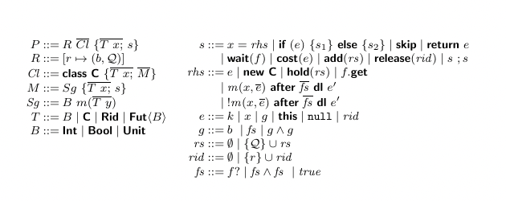

RABS Tools
=========

Inside this repository we develop the core tools of the `RABS` modelling
language.

## Language Manual

### Introduction

`RABS` is inspired by an active object language [ABS](https://abs-models.org/), and has a Java-like syntax and actor-based concurrency model. In actor-based concurrency models, actors are primitives for concurrent computation. Actors can send a finite number of messages to each other, create a finite number of new actors, or alter their private states. One of the primary characteristics of actor-based concurrency models is that only one message is processed per actor, so the invariants of each actor are preserved without locks.

In addition, the language has
explicit notions for logical disjunction and conjunction between the task dependencies, qualitative assessment of resources, method invocation with deadlines and time
advancement. The language also supports a static cost analysis which allows the workflow analysers to estimate the effect
of changes in collaborative workflows with respect to cost in terms of
execution time.

### Syntax
The syntax of the `RABS` is given below.  An overlined element represents a (possibly empty) finite sequence of such elements separated by commas. 

A `RABS` program `P` comprises resources $R$, a sequence of class declarations $\many{Cl}$ and a main method body $\{ \many{T \ x;}\ s\}$, where $\many{T \ x;}$ is the declaration of local variables and $s$ is a statement.

%
Types~$T$ in $\rpl$ are basic types~$B$, classes~$\key{C}$, sets of resource identifiers $\Rid$ and future types $\fut{B}$. An asynchronous method invocation is associated to a future variable $f$ of type $\fut{B}$, where~$B$ is the return type of the invoked method.
One can see a future as a mailbox that is created by the time a method is asynchronously invoked, and the caller object continues its own execution after the invocation.  When the invoked method has completed the execution, the return value will be placed into the mailbox, i.e., the future.  Basic types $B$ include integers $\Int$, booleans $\Bool$, and empty types $\Unit$.

## **Installing Dependencies**

Running the RABS compiler requires Java (version 11 or greater) and Erlang (version 23 or greater) installed. Java can be downloaded, e.g., from https://adoptopenjdk.net. Erlang is available at https://www.erlang.org/downloads (but also check below for platform-specific instructions).

### **Installing dependencies on MacOS**

On MacOS, the homebrew package manager can be used to install the dependencies. After installing homebrew, run the following commands in a terminal:

`brew tap adoptopenjdk/openjdk`

`brew install erlang git adoptopenjdk11`

### Installing dependencies on Windows

On windows, the chocolatey package manager can be used to install the dependencies. First install chocolatey following the instructions at https://chocolatey.org/install, then run the following command in a terminal with Administrator rights:

`choco install openjdk11 git erlang visualstudio2019buildtools`

To compile the RABS tools, make sure to run the command `./gradlew` build from a developer shell (Start -> Visual Studio 2019 -> Developer PowerShell for VS 2019).

### Installing dependencies on Linux

On Linux, check if your distribution offers the necessary programs pre-packaged in the version needed (JDK11, Erlang >= 23, a C compiler); otherwise download from the distribution pages linked above.

## Compiling the RABS compiler from source

To compile the RABS compiler from source, clone the git repository and run gradle (after installing the necessary dependencies):

### Linux or macOS

`git clone https://github.com/razi236/ResourceABS`

`cd abstools`

`./gradlew assemble`

`frontend/bin/absc --help`

### Windows

`git clone "https://github.com/razi236/ResourceABS"`

`cd abstools`

`.\gradlew assemble`

`frontend\bin\absc.bat --help`

